# ارزیابی عملکردی پلتفرم معاملاتی: از پژوهش تا Paper و Live

**مخاطب:** مالک پروژه  
**نویسنده:** Manus AI  
**دامنه:** داده‌های بازار XAUUSD و EURUSD، replay، backtest، استراتژی‌های S0/SMC و چندسبکی، paper trading، OMS و اتصال cTrader Demo  
**مبنای گزارش:** تجمیع ممیزی‌های صرفاً خواندنی از working tree پروژه و پژوهش مستندات رسمی. در این ارزیابی هیچ کدی تغییر نکرده است. خطای اجرایی حل‌نشده‌ای در ورودی ارزیابی گزارش نشده است.

> **حکم اجرایی:** وضعیت فعلی برای نمایش آموزشی، UI prototype و آزمون‌های قراردادی مناسب است؛ اما برای ادعای مزیت آماری، انتخاب خودکار سبک، Paper Trading واقعی، یا اتصال عملیاتی cTrader Demo **NO-GO** است. هیچ استراتژی، از جمله S0، پیش از **بک‌تست بدون نشت آینده، walk-forward زمان‌مند، آزمون خارج‌نمونهٔ untouched و paper trading با تطبیق مستقل** قابل اعتماد نیست. این گزارش تحلیل مالی شخصی، توصیهٔ سرمایه‌گذاری، یا مجوز معامله نیست.

## 1. جمع‌بندی مدیریتی و تصمیم پیشنهادی

سامانه امروز چند قطعهٔ مفید دارد: قرارداد زمان Unix-ms، clock مجازی، کنترل‌هایی برای quote نامرتب، ATR با هموارسازی Wilder، تأیید با تأخیر پیوت‌ها، ورود بک‌تستر چندسبکی در بازشدن کندل بعدی، و برخی کنترل‌های OMS مانند idempotency، تأیید کاربر و fail-closed پیش‌فرض Live. با وجود این، زنجیرهٔ شواهد از دادهٔ قابل‌اتکا تا اجرای قابل‌ممیزی کامل نیست. دو fixture اصلی تنها ۲۰ کندل پنج‌دقیقه‌ای دارند، synthetic/سناریومحور هستند، و حتی از اعتبارسنجی پایهٔ OHLC عبور نمی‌کنند. بنابراین هر PnL، win rate، Sharpe یا «تأیید alpha» حاصل از آن‌ها فاقد اعتبار پژوهشی است. [1] [2]

مهم‌ترین شکست زنجیره‌ای این است که کد و UI ظاهری فراتر از شواهد محاسبه‌شده القا می‌کنند. S0 در نام به «Liquidity Sweep + FVG» اشاره دارد، اما detector عملیاتی FVG، BOS/CHoCH و order block در مسیر تولید candidate وجود ندارد. افزون بر آن، scanner شورا برای S0 هم‌زمان `sweepId` و `fvgId` می‌خواهد، در حالی که مولدهای موجود `fvgId` تولید نمی‌کنند. نتیجهٔ محتمل در مسیر پیش‌فرض، رد شدن تمام candidateها و بک‌تست صفرمعامله است؛ آزمون‌های report-shape یا تکرارپذیری با آرایهٔ خالی نمی‌توانند edge را اثبات کنند. [3] [4]

مسیر `PAPER_LIVE` نیز paper trading مبتنی بر quote نیست. OMS فوراً acknowledgement و شناسهٔ مصنوعی می‌سازد و به quote، صف سفارش، fill، position یا ledger واحد متصل نمی‌شود. Gateway cTrader یک scaffold ارزشمند است، ولی credential/session OAuth را به process اجرا bind نمی‌کند، symbol ID و حجم را hard-code می‌کند، و برای پیام binary بدون Protobuf codec به `DEGRADED` می‌رود. در نتیجه هیچ شاهد end-to-end از سفارش Demo تا deal، position، accounting و reconciliation وجود ندارد. [5] [6]

**تصمیم پیشنهادی:** تا تحقق گیت‌های P0 این گزارش، مسیرهای promotion به Paper و Demo مسدود، UI با برچسب روشن `SIMULATED / NOT READY` نمایش داده شود، و هر دسترسی احتمالی Live غیرعملیاتی باقی بماند. کار ۹۰ روز آینده باید ابتدا به ساخت خط لولهٔ داده و execution canonical اختصاص یابد، نه افزودن سیگنال یا داشبورد جدید.

## 2. مدل بلوغ و آمادگی فعلی

امتیازها نشان‌دهندهٔ قابلیت اتکای عملیاتی برای تصمیم‌گیری و تحقیق‌اند، نه کیفیت رابط کاربری یا تلاش مهندسی. امتیاز ۱ به معنی «نامناسب برای استفادهٔ عملیاتی» و ۵ به معنی «قابل‌ممیزی، تکرارپذیر، و عبور کرده از گیت‌های تعریف‌شده» است.

| قلمرو | بلوغ فعلی | شواهد مثبت موجود | شکاف تعیین‌کننده | تصمیم فعلی | شرط ارتقا |
|---|---:|---|---|---|---|
| دادهٔ بازار و catalog | **1/5** | قرارداد Candle با Unix-ms؛ validator اولیه؛ کنترل quote نامرتب در gateway | fixtureهای synthetic و بسیار کوتاه؛ OHLC نامعتبر؛ provenance، hash کامل، bid/ask و metadata نسخه‌دار ندارند | فقط unit/UI demo | raw tick یا bar معتبر، immutable، hash‌شده و catalog‌شده |
| Replay و Backtest | **1/5** | clock مجازی؛ ورود t+1 در MultiStyle؛ سیاست بدبینانه intrabar در موتور مجزا | ResearchLab نشت همان کندل دارد؛ executionها همگرا نیستند؛ هزینه و fill ناقص‌اند | فقط آزمایش مهندسی | موتور canonical، event-time، side-aware، no-leakage و golden-fill |
| Paper Trading داخلی | **1/5** | adapter و simulatorهای اولیه؛ kill-new-entries | PAPER_LIVE fill/position/ledger واقعی ندارد؛ stale gate و lifecycle کامل نیست | غیرعملیاتی | broker واحد مبتنی بر quote، event ledger و reconciliation |
| OMS و execution / cTrader Demo | **2/5** | outbox اولیه، idempotency، epoch، user confirmation، timeout محافظه‌کار | OAuth–worker جدا؛ codec/protocol نامطمئن؛ symbol/volume hard-code؛ cancel/close/reconcile کامل نیست | Demo عملیاتی ممنوع | worker دائمی، account fence، lifecycle کامل، soak و reconciliation |
| استراتژی‌ها و regime | **1/5** | ATR Wilder؛ pivot با تأیید i+2؛ برخی گیت‌های signal closed-bar | FVG/BOS/OB عملیاتی نیستند؛ S0 با specification ناسازگار؛ regime heuristic؛ evidence chain ناقص | فرضیهٔ پژوهشی، نه strategy | detectorهای نسخه‌دار، تست مثبت/منفی، OOS و ablation |
| بازتولید و کنترل انتشار | **1/5** | PRNG seeded در یک Monte Carlo؛ testهای قراردادی | seed پیش‌فرض و IDها غیرقطعی؛ manifest کامل نیست؛ suiteهای مهم در runner رسمی نیستند | صرفاً توسعه | run manifest immutable، seed اجباری و CI جامع |

ارزیابی فعلی برای **آموزش و نمایش: حدود 3/5** است، زیرا interaction و اجزای دامنه‌ای قابل مشاهده‌اند. با این حال برای پژوهش قابل اتکا، انتخاب استراتژی و سرمایه‌گذاری **1/5** باقی می‌ماند. عبور تست‌های فعلی—۱۶ suite و ۸۸ check در runner رسمی، با اجرای دستی موفق چند suite دیگر—تنها سلامت بخشی از قراردادهای کنونی را نشان می‌دهد. runner رسمی در زمان ممیزی suiteهای Monte Carlo، multi-style-backtester و multi-style-regimes را import نمی‌کرد؛ بنابراین PASS فعلی شواهد اعتبار تاریخی یا عملیاتی نیست. [7]

## 3. واقعیت کد در برابر ادعا یا برداشت احتمالی UI

جدول زیر باید مرجع متن‌های محصول، tooltipها، گزارش‌های PnL و runbook باشد. هر برچسبی که فراتر از ستون «واقعیت فعلی» باشد، باید تا ساخت شواهد لازم حذف یا با برچسب فرضیه/شبیه‌سازی محدود شود.

| موضوع یا برداشت UI | واقعیت قابل استنباط از کد و ممیزی | پیام محصول و تصمیم |
|---|---|---|
| «Historical replay» یا «دادهٔ بازار» | replay پیش‌فرض عمدتاً بر fixtureهای ۲۰ کندلی و live-feed random-walk با quality=`SIMULATED` تکیه دارد. fixtureهای EURUSD و XAUUSD در یک timestamp، شرط `high ≥ max(open, close)` را نقض می‌کنند. [1] | فقط «دادهٔ نمونه/آموزشی»؛ ممنوعیت نمایش performance به‌عنوان تاریخی |
| «قیمت زنده» یا «اتصال cTrader» | live-feed پیش‌فرض simulated است. gateway بدون credential fail-closed است و binary بدون codec به degraded می‌رود. اتصال WebSocket به‌تنهایی readiness معامله نیست. [6] | وضعیت باید شامل `SIMULATED`، `AUTHENTICATED`، `SUBSCRIBED`، `RECONCILED` و `READY` باشد؛ تنها READY مجاز به ارسال است |
| «Paper Live» | OMS شناسهٔ `PAPER-SIM-ORD-*` و acknowledgement فوری می‌سازد؛ به quote و lifecycle بروکر متصل نیست. [5] | نام آن به «OMS simulation» تغییر کند؛ Paper Trading تا پیاده‌سازی P0 تبلیغ نشود |
| «S0 Sweep + FVG» | S0 sweep ساده دارد، اما FVG detector و `fvgId` ندارد. Scanner در مسیر داخلی برای S0 هر دو evidence را می‌خواهد. [3] [4] | به «S0 hypothesis: sweep-only prototype» تغییر کند؛ وضعیت strategy=`NO_TRADE` تا تکمیل evidence |
| «BOS/CHoCH، Order Block، Equilibrium» | این مفاهیم در interfaces، knowledge base یا visualization دیده می‌شوند، ولی detector/lifecycle و اتصال آن‌ها به order rule عملیاتی نیست. [3] | نمایش صرفاً آموزشی؛ هیچ confidence یا score اجرایی به آن‌ها نسبت داده نشود |
| «Stress test spread/slippage» | `additionalSlippagePips` در metadata سناریو می‌ماند و الزاماً به `runBacktest`/fill منتقل نمی‌شود. مدل candle نیز هزینهٔ خروج و fill limit را به‌درستی side-aware اعمال نمی‌کند. [2] | گزارش stress کنونی برای تصمیم عملکردی فاقد اعتبار است |
| «Monte Carlo confidence» | یک simulator قابلیت seed دارد، اما مسیرهای UI و backtester اغلب `Date.now()` یا `Math.random()` دارند. پارامتر GBM نیز از دیتاست/افق واقعی کالیبره نشده است. [2] [4] | فقط تحلیل سناریویی؛ نه فیلتر پیش‌بینی‌کنندهٔ edge |
| «Health=Healthy» | health ممکن است با gateway خاموش، credential ناقص یا quote stale همچنان healthy باشد؛ latency نیز زمان تولید پاسخ است، نه latency execution. [5] | health باید از readiness معاملاتی جدا شود و فیلدهای freshness، auth، queue، DB و reconciliation داشته باشد |

## 4. ارزیابی فنی استراتژی‌ها و مفاهیم معاملاتی

### 4.1 S0: وضعیت واقعی و ارزیابی

**S0 فعلی یک prototype از sweep ساده است، نه implementation قابل دفاعِ SMC.** شرط آن اساساً عبور `low` از swing low و بسته‌شدن مجدد بالای آن، یا قرینهٔ سقف، در همان کندل جاری است. سطح sweep به PDH/PDL، Asia/London range، EQH/EQL تأییدشده، حداقل نفوذ، نسبت wick/body، سرعت reclaim، session، حجم یا یک‌بارمصرف‌بودن سطح مقید نیست. فیلد `broken` در swingها نیز به‌روزرسانی نمی‌شود؛ بنابراین سطح قدیمی یا قبلاً شکسته‌شده ممکن است همچنان کاندیدا باشد. [3]

از منظر زمان‌بندی، pivot با دو کندل سمت راست تأیید می‌شود و S0 آخرین کندل بسته را ارزیابی می‌کند؛ این بخش برای جلوگیری از نگاه‌آیندهٔ موضعی مناسب است. اما یک کنترل محلی کافی نیست: داده باید معتبر باشد، candidate باید timestamp تأیید و evidence immutable داشته باشد، و execution تنها در event معتبر بعدی رخ دهد. در `ResearchLab` signal ساخته‌شده با OHLC کندل t می‌تواند همان لحظه به `processCandle` برسد و سفارش LIMIT را با high/low همان کندل fill یا exit کند. این نشت آینده، اعتبار عملکرد را از بین می‌برد. [2] [3]

مشخصات و کد S0 نیز هم‌راستا نیستند. دانش‌پایه ورود limit در CEِ FVG و حدضرر sweep-wick به‌علاوهٔ 1.5 ATR یا 1 pip را توصیف می‌کند، در حالی که S0 فعلی بر مبنای close قیمت می‌دهد، بک‌تستر آن را در open بعدی شبیه market اجرا می‌کند و از stop با 0.3 ATR استفاده می‌کند. `candles15M` نیز استفاده نمی‌شود. هیچ ادعای عملکرد نباید تا نسخه‌بندی صریح rule و انتخاب یک specification واحد منتشر شود. [3]

### 4.2 Sweep و FVG: تعریف عملیاتی لازم

**Liquidity sweep** باید یک رویداد داده‌محور و بازتولیدپذیر باشد. سطح فقط از swing تأییدشده یا بازهٔ کامل از پیش تعریف‌شده مانند PDH/PDL یا Asia range ساخته شود. برای EQH/EQL دست‌کم دو touch با فاصلهٔ زمانی و tolerance برابر `max(tickSize, k × ATR)` لازم است. sweep باید حداقل نفوذ `max(1 pip, 0.1 × ATR)`، reclaim body-close به داخل سطح طی ۱ تا ۳ bar، حداقل نسبت wick به range، و وضعیت «تاکنون مصرف‌نشده» داشته باشد. هر event باید سطح هدف، extreme، quote-side، زمان مشاهده، زمان تأیید، session و علت invalidation را ثبت کند.

**Fair Value Gap (FVG)** باید detector مستقل و نسخه‌دار داشته باشد. تعریف پیشنهادی اولیه برای FVG صعودی این است که پس از بسته‌شدن bar `t`، شرط `high[t-2] < low[t]` برقرار باشد، اندازهٔ شکاف حداقل `0.3 × ATR[t]` باشد، و شرط displacement از پیش مصوب نیز برقرار باشد. محدودهٔ دقیق gap، timeframe، حداقل اندازه، وضعیت fresh/partial/full mitigation، و invalidation باید به‌صورت event باربه‌بار به‌روزرسانی شود. تعریف نزولی قرینه است. این تعریف تنها فرضیهٔ شروع است و باید پیش از پژوهش freeze شود؛ انتخاب پسینی threshold یا timeframe مجاز نیست.

| مؤلفه | وضعیت فعلی | تعریف/قانون لازم پیش از آزمون | آزمون پذیرش حداقلی |
|---|---|---|---|
| swing | pivot strict ۲چپ/۲راست با تأیید دیرهنگام موجود است | rule version، equal-high/low tolerance، freshness و شکست سطح | fixture مثبت/منفی/مرزی؛ timestamp تأیید همیشه بعد از دادهٔ لازم |
| sweep | شکست و reclaim تک‌کندلی ساده | سطح معتبر، نفوذ، reclaim، wick، session، invalidation و one-use | حداقل ۳۰ fixture برچسب‌خورده؛ ممنوعیت signal از سطح broken |
| FVG | interface/نام‌گذاری؛ detector عملیاتی ندارد | سه-bar gap، ATR threshold، displacement، mitigation lifecycle | fixtureهای bullish/bearish/overlap/partial-fill؛ عدم ایجاد `fvgId` کاذب |
| زنجیرهٔ S0 | evidence ناقص و scanner ناسازگار | `sweep → MSS/BOS → displacement/FVG یا OB retest → order` | integration test با حداقل یک order واقعی و یک rejected evidence chain |

### 4.3 BOS/CHoCH و Order Block

BOS (Break of Structure) یا CHoCH نباید نامی برای هر شکست قیمت باشد. قانون پیشنهادی اولیه باید صراحتاً بگوید close بدنه، و نه صرف wick، با بافر `max(tickSize, k × ATR)` از آخرین swing مخالفِ **تأییدشده و فعال** عبور کند. قانون باید مشخص کند آیا این رخداد پس از sweep و در چه پنجرهٔ زمانی معتبر است. distinction میان BOS و CHoCH باید به trend-state قبلی وابسته، نسخه‌دار و قابل آزمون باشد.

Order block نیز صرفاً «آخرین کندل مخالف» نیست. تعریف قابل آزمون آن باید آخرین کندل مخالف پیش از displacementی باشد که BOS معتبر را تولید کرده است. محدودهٔ قیمت، حداقل displacement، وضعیت untouched/mitigated/invalidated و قانون retest باید ذخیره شود. در وضعیت فعلی این detectorها در مسیر execution وجود ندارند؛ بنابراین UI یا گزارش حق ندارد آن‌ها را evidence محاسبه‌شده، تأیید ساختار، یا علت ورود معرفی کند. [3] [4]

### 4.4 Equilibrium، premium/discount و Mean Reversion

**Equilibrium/premium/discount** فعلی بیشتر یک visualization است. midpoint سقف/کف روز پیشین معادل midpoint یک لگ تکانه‌ای ساختاری نیست. برای یک قاعدهٔ معاملاتی، باید یک لگ شناسه‌دار `low → high` یا `high → low` با آغاز، پایان، timeframe و تأیید ساختار مشخص انتخاب شود. midpoint آن لگ مبنای equilibrium باشد. BUY تنها پایین‌تر از midpoint و SELL تنها بالاتر از midpoint، به همراه trigger و invalidation مستقل، قابل بررسی است. مدل midpoint روز قبل اگر نگه‌داری می‌شود، باید یک strategy/model مجزا با hypothesis جدا باشد. [4]

**Mean reversion** باید کاملاً از SMC جدا ارزیابی شود. کد فعلی آمار میانگین/انحراف معیار را با کندل trigger مخلوط می‌کند، reclaim را با شروطی نزدیک به بدیهی مانند `close > low` نشان می‌دهد، و hard gate رژیم ندارد. نسخهٔ قابل آزمون باید آمار را از پنجرهٔ پیش از trigger بسازد، regime range را الزام قطعی کند، عبور z-score و reclaim band/EMA را تعریف کند، و entry، stop، target و time-stop را پیش از ورود freeze کند. نتیجهٔ آن نباید با S0 ادغام شود؛ performance، exposure و شکست‌پذیری هر فرضیه جداگانه گزارش شوند. [4]

### 4.5 Regime و بک‌تستر چندسبکی

طبقه‌بند regime فعلی heuristic و کالیبره‌نشده است. «ADX» آن شمارش کلی closeهای بالاتر/پایین‌تر است، نه ADX؛ `volumeZScore` انحراف معیار ندارد؛ ATR ratio با قرارداد rolling-50 یکسان نیست؛ و slope EMA به ATR-per-bar و timeframe نرمال نشده است. دادهٔ کمتر از ۱۵ کندل نیز به CHOPPY و پیشنهاد scalp/mean reversion منتهی می‌شود، در حالی که رفتار محافظه‌کار باید **NO_TRADE** باشد. `blockedStyles` امتیاز را کاهش می‌دهد، نه اینکه ممنوعیت سخت ایجاد کند. [4]

بک‌تستر چندسبکی توانایی‌های مفیدی مانند ورود open کندل بعدی، کمیسیون/اسپرد/اسلیپیج ورودی، sizing ریسک و خروج جزئی دارد. اما از موتور رویدادمحور واحد استفاده نمی‌کند؛ بنابراین سیاست بدبینانهٔ intrabar، fill side-aware، gap، slippage خروج، expiry، lot step، margin، mark-to-market انتهای نمونه و equity/MDD درون‌معامله را کامل به ارث نمی‌برد. round-to-nearest حجم می‌تواند سقف ریسک را بشکند و sizing با قیمت پیشنهادی، نه fill واقعی، صورت می‌گیرد. تا همگرایی executionها، مقایسهٔ strategyها معتبر نیست. [2] [4]

## 5. کیفیت داده، timestamp و هزینه‌های واقعی

### 5.1 وضعیت دادهٔ فعلی

دو fixture `EURUSD_CANDLES_FIXTURE_5M` و `GOLD_CANDLES_FIXTURE_5M` هرکدام ۲۰ کندل پنج‌دقیقه‌ای، یعنی تقریباً ۱۰۰ دقیقه، دارند. نام‌گذاری سناریومحور، نبود provider/license/provenance و نبود فایل raw versioned آن‌ها را به دادهٔ unit/demo محدود می‌کند. در timestamp `1725600900000`، در هر دو fixture مقدار high از open یا close پایین‌تر گزارش شده است؛ نمونهٔ EURUSD: `high=1.0866 < open=1.0868` و نمونهٔ XAUUSD: `high=2650 < open=2651`. هر دو validator را `isValid=false` می‌کنند. [1]

`DataWorkbench` قابلیت‌هایی برای کنترل OHLC، gap، warmup، duplicate timestamp و مرتب‌سازی دارد، اما source authenticity، timezone/DST/session، تشخیص seconds در برابر milliseconds، bid/ask، volume، duplicate policy قطعی و checksum رمزنگاری‌شده را تضمین نمی‌کند. تابعی با نام `sha256Hash` در عمل hash نمونه‌برداری‌شدهٔ ۳۲بیتی است و `DatasetManifest.id` با `Date.now()` ساخته می‌شود؛ این دو مورد با نام و نقش مورد انتظار برای reproducibility سازگار نیستند. [1]

### 5.2 حداقل schema داده و manifest پژوهشی

دادهٔ خام باید append-only باشد. bar و feature artifact مشتق‌شده‌اند و نباید جای raw tick را بگیرند. timestamp مرجع event-time منبع است؛ `received_at` فقط برای سنجش latency و audit ذخیره می‌شود. همهٔ زمان‌ها UTC بوده و نمایش timezone محلی صرفاً در لایهٔ presentation انجام می‌شود.

| موجودیت | فیلدهای اجباری حداقل | کلید/قید کیفیت | کاربرد |
|---|---|---|---|
| `symbol_catalog` | `provider`, `broker_account_env`, `symbol_id`, `symbol_code`, `asset_class`, `digits`, `tick_size`, `lot_min`, `lot_max`, `lot_step`, `contract_size`, `margin_rule`, `trading_sessions`, `swap_long`, `swap_short`, `effective_from`, `effective_to`, `metadata_version` | یکتایی `(provider, symbol_id, effective_from)`؛ تغییر specification نسخه‌دار | تبدیل قیمت/حجم و کنترل execution |
| `raw_quote_tick` | `provider`, `connection_id`, `account_env`, `symbol_id`, `event_time_utc_ms`, `received_at_utc_ms`, `sequence_or_request_id`, `bid`, `ask`, `quote_type`, `source_payload_ref`, `ingest_run_id` | `bid ≤ ask` در quote کامل؛ timestamp و sequence پایدار؛ payload قابل بازیابی | منبع حقیقت replay، spread و fill |
| `raw_trade_tick` | فیلدهای provider/symbol/time/sequence، `price`, `size`, `trade_flags`, `source_payload_ref` | schema-version و dedup policy صریح | liquidity/analysis در صورت دسترس‌پذیری |
| `derived_bar` | `dataset_version`, `symbol_id`, `timeframe`, `bar_open_utc_ms`, `open`, `high`, `low`, `close`, `bid_open/ask_open` در صورت موجود، `tick_count`, `is_closed`, `builder_version` | OHLC معتبر؛ یکتایی `(dataset_version,symbol,timeframe,open)`؛ bar ناقص `is_closed=false` | feature و signal، نه جایگزین raw |
| `feature_event` | `run_id`, `event_id`, `rule_version`, `symbol_id`, `timeframe`, `observed_at`, `confirmed_at`, `feature_type`, `numeric_payload`, `source_bar_ids`, `status` | فقط sourceهای پیش از `confirmed_at`؛ immutable | swing، sweep، FVG، BOS، OB، regime |
| `order_intent` | `correlation_id`, `strategy_version`, `signal_time`, `eligible_from`, `side`, `order_type`, `limit/stop`, `qty`, `SL/TP`, `expiry`, `cost_model_version`, `evidence_ids` | signal قبل از eligible event؛ evidence immutable | تصمیم قابل‌ممیزی |
| `execution_event` | `event_id`, `correlation_id`, `broker_order_id`, `deal_id`, `sequence`, `event_time`, `received_at`, `state`, `filled_qty`, `remaining_qty`, `fill_bid/ask`, `fill_price`, `reason` | append-only؛ idempotency؛ transition guard | OMS، ledger و reconciliation |
| `run_manifest` | `run_id`, `git_commit`, `engine_version`, `dependency_lock_hash`, `dataset_id`, `raw_sha256`, `derived_dataset_hash`, `schema_version`, `timezone`, `calendar_version`, `config_canonical_json`, `seed`, `cost_model_version`, `started_at`, `finished_at` | immutable؛ hash کامل فایل/partition؛ یک run قابل replay | بازتولید و audit |

برای هر فایل یا partition خام، SHA-256 **کامل**، row count، min/max event time، schema version و محل payload خام ثبت شود. سازوکار dedup باید از ابتدا تعریف شود؛ مثلاً کلید `(provider, symbolId, quoteType, eventTime, sequence/price)` و سیاست برخورد با collision در manifest ثبت گردد. مرتب‌سازی پنهانی ورودی برای حذف خطا قابل قبول نیست: ورودی out-of-order باید با reason flag شود و تنها پس از سیاست صریح merge/reject وارد dataset مشتق شود.

### 5.3 مدل هزینه و fill که باید واقعاً اجرا شود

هزینه، فقط یک عدد spread یا commission در report نیست. هر order باید بر پایهٔ quote درستِ سمت معامله ارزش‌گذاری، fill و mark شود: خرید با **ask** و فروش با **bid**. cTrader نیز هشدار می‌دهد که eventهای spot الزاماً هر دو bid و ask را در هر پیام ندارند؛ replay باید quote ناقص را reject/flag کند یا با policy محافظه‌کار ثبت‌شده اداره کند. [8]

| مؤلفهٔ هزینه/اجرا | حداقل مدل لازم | فیلدهای ثبت‌شونده | آزمون کنترل |
|---|---|---|---|
| spread | bid/ask تاریخیِ زمان event؛ در نبود آن سناریوی بدبینانهٔ نسخه‌دار | bid، ask، mid، spread، quote age | BUY هرگز زیر ask و SELL هرگز بالای bid fill نشود |
| commission | per-side، نرخ account/symbol، currency و تبدیل ارز | نرخ، ارز، مبلغ هر deal، FX rate | مجموع کمیسیون dealها با statement/replay سازگار باشد |
| slippage و latency | adverse-only یا distribution کالیبره‌شده بر session، ATR، size و liquidity؛ latency event-based | signal/submit/ack/fill timestamps، slippage pips، مدل/version | افزایش spread/slippage هرگز PnL را بهتر نکند |
| stop/limit و gap | trigger-side مشخص؛ policy برای gap، intrabar path و queue/partial/no-fill | trigger quote، fill quote، gap flag، queue/partial reason | golden-fill برای gap و برخورد هم‌زمان SL/TP |
| financing/swap | نرخ daily/rollover حساب و conversion | نرخ، زمان rollover، ارز، مبلغ | تطبیق با broker statement در Demo |
| محدودیت instrument | lot min/max/step، contract size، margin، session و expiry | specification version، qty requested/accepted، reject reason | order نامعتبر پیش از ارسال reject شود |

Stress test تنها هنگامی معتبر است که پارامترهای stress واقعاً به engine fill برسند. سناریوهای حداقلی عبارت‌اند از base تاریخی، spread برابر صدک ۹۵، spread ×1.5، slippage adverse، session کم‌نقدشونده و gap. برای هر سناریو، همان dataset، seed و order intent استفاده شود و تفاوت تنها cost-model version باشد. هر موردی که افزایش هزینه باعث بهبود سود خالص شود، failure تحقیقاتی تلقی گردد مگر با trace قابل توضیح.

## 6. معماری هدف: داده‌محور، قابل‌ممیزی و event-time

معماری هدف باید یک «هستهٔ execution و ledger» مشترک برای research replay، simulator داخلی، paper quote-driven و cTrader Demo داشته باشد. تفاوت محیط‌ها باید فقط adapter داده و adapter broker باشد، نه منطق signal، fill یا accounting.

```mermaid
flowchart LR
  A[cTrader/Provider\nraw tick bid/ask + metadata] --> B[Ingestion Worker\ncheckpoint, rate limit, payload archive]
  B --> C[Immutable Object Storage\nraw partitions + full SHA-256]
  B --> D[Catalog & Quality Gate\nsymbol spec, UTC, schema, dedup]
  C --> E[Bar/Feature Builder\nclosed bars only]
  D --> E
  E --> F[Versioned Feature Events\nswing, sweep, FVG, BOS, OB, regime]
  F --> G[Research Orchestrator\ntrain / validation / untouched test]
  G --> H[Canonical Execution Engine\nbid/ask, costs, latency, fills]
  C --> H
  H --> I[Immutable Run Manifest\norder/fill trace + metrics]
  I --> J[Promotion Gate]
  J --> K[Paper Broker Adapter\nreal quote-driven simulation]
  K --> L[Execution Worker\nDemo cTrader, account fence]
  L --> M[Broker Events & Snapshots]
  M --> N[Reconciliation + Deal Ledger + Alerts]
  N --> J
```

### 6.1 لایهٔ ingestion و data quality

Ingestion باید service/worker پایدار و جدا از requestهای Next باشد. برای cTrader Open API، historical bar با `ProtoOAGetTrendbarsReq/Res` و tick با `ProtoOAGetTickDataReq/Res` دریافت می‌شود. درخواست tick حداکثر یک هفته را پوشش می‌دهد، ممکن است سقف پاسخ بخورد و با `hasMore` نیاز به ادامه داشته باشد، و نرخ historical حداکثر ۵ درخواست بر ثانیه به ازای هر connection است. [8] [9]

وظایف worker عبارت‌اند از discovery و versioning symbol specification، واکشی پنجره‌های حداکثر هفت‌روزه با checkpoint، retry محدود با jitter، ثبت request ID و `hasMore`، ذخیرهٔ raw payload پیش از normalisation، validation و dedup، و منتشر کردن partition immutable. شکست ingest نباید به تولید bar ساختگی یا پرکردن silent gap منجر شود. Gap باید به‌عنوان event کیفیت داده ثبت و در تصمیم strategy قابل مشاهده باشد.

### 6.2 لایهٔ پژوهش و replay

Replay باید با **event-time** منبع clock شود، نه `Date.now()` یا زمان دریافت. bar تنها پس از پایان بازه و `is_closed=true` به strategy تحویل می‌شود. signal ساخته‌شده در close bar t حداقل از اولین quote/event واجد شرایط در t+1 مجاز به entry است. higher-timeframe bucket ناقص هرگز closed یا قابل‌مشاهده برای signal نیست. simulator باید state خود، broker، event store و PRNG را با virtual clock و seed واحد reset کند.

هر result باید سه سطح artifact داشته باشد: (۱) dataset/feature versions، (۲) config و seed، و (۳) trace کامل signal → order intent → quote → fill → deal → position → exit. بدون این سه سطح، عدد PnL یک observation غیرقابل‌ممیزی است.

### 6.3 OMS، paper و Demo

OMS باید از request/response Next جدا و به worker تک‌نویسنده با DB تراکنشی منتقل شود. outbox، idempotency key، order state، deal، position، journal و reconciliation incident باید durable، append-only و multi-process safe باشند. state machine باید `SUBMITTING`، `ACKNOWLEDGED`، `PARTIALLY_FILLED`، `FILLED`، `CANCELLED`، `REJECTED` و `UNKNOWN_RECONCILE_REQUIRED` را با sequence و transition guard پشتیبانی کند. event دیررس نباید state را به عقب برگرداند.

OAuth باید `state` server-side اعتبارسنجی‌شده، refresh-token lifecycle، secret store و binding امن session به worker داشته باشد. Gateway پیش از account authentication، account discovery/selection، account-ID fence، symbol discovery، metadata validation و subscription آماده تلقی نشود. cTrader Demo و Live کاملاً محیط‌های جدا هستند و endpoint/connection مستقل می‌خواهند؛ Demo باید تنها محیط promotion بعد از research باشد. [10] [11]

Kill switch باید صرفاً «ممانعت از entry جدید» نباشد. عملیات جداگانه و نتیجه‌دار `cancel-all pending` و `close-all positions` لازم است؛ هرکدام با account fence، confirmation policy، broker acknowledgement و reconciliation پس از اجرا. health نیز باید readiness واقعی شامل gateway auth/subscription، quote freshness برای هر symbol، queue depth، DB write، account fence، pending unknown، protection failure و زمان آخرین reconciliation را گزارش کند.

## 7. طراحی Research → Paper → Live با گیت‌های پذیرش کمی

اعداد این بخش **معیارهای پیشنهادی حاکمیتی** هستند، نه تضمین سود یا جایگزین judgment کمیتهٔ ریسک. آستانه‌ها باید پیش از آغاز هر مطالعه تصویب و در registry آزمایش freeze شوند. عبور هر گیت صرفاً اجازهٔ ورود به گیت بعدی است و هرگز اثبات edge یا مجوز Live نیست.

| گیت | هدف و خروجی غیرقابل‌مذاکره | معیار پذیرش کمی پیشنهادی | نتیجهٔ عدم قبولی |
|---|---|---|---|
| **G0: Data Ready** | catalog، raw archive، dataset manifest و report کیفیت | ۱۰۰٪ فیلدهای اجباری/UTC/schema معتبر؛ ۱۰۰٪ partitionها با SHA-256 کامل و row count؛ ۰ OHLC نامعتبر در barهای پذیرفته‌شده؛ ۱۰۰٪ تغییر specification نسخه‌دار؛ حداقل ۲۴ ماه دادهٔ پیوسته برای هر symbol با coverage صریح session | stop پژوهش؛ فقط fixture unit مجاز |
| **G1: Engine Integrity** | replay event-time و execution canonical | ۱۰۰٪ signalها دارای `eligible_from > signal_time`؛ ۰ fill روی همان bar سازندهٔ signal؛ ۱۰۰٪ testهای seconds/ms، DST، partial bar و out-of-order PASS؛ ۱۰۰٪ golden-fillهای bid/ask/gap/SL-TP PASS؛ full replay با dataset/config/seed یکسان byte-for-byte یا metric-identical | توقف backtest عملکردی؛ رفع P0 |
| **G2: Strategy Research** | hypothesis registry، rules frozen، ablation و OOS report | حداقل ۴ fold walk-forward expanding/rolling؛ embargo حداقل برابر بیشینهٔ holding period؛ holdout نهایی untouched حداقل ۲۰٪ انتهای زمان؛ حداقل ۱۰۰ معاملهٔ OOS برای هر strategy–symbol **یا** گزارش صریح ناکافی‌بودن نمونه؛ گزارش CI bootstrap ۹۵٪، PBO/CSCV و همهٔ هزینه‌ها | strategy=`RESEARCH_ONLY` یا `NO_TRADE` |
| **G3: Robustness** | حساسیت cost/parameter/regime و reproducibility | عملکرد خالص در base و cost-stress؛ نتایج جدا در آسیا/لندن/نیویورک و رژیم‌های volatility؛ ۱۰۰٪ runها seed/manifest دارند؛ هیچ سناریوی افزایش هزینه بدون trace نباید سود خالص را بهبود دهد | ممنوعیت promotion؛ بازنگری فرضیه |
| **G4: Internal Paper** | simulator مبتنی بر quote واقعی و ledger مشترک | ۱۰۰٪ orderها دارای quote-side/fill trace؛ entry در quote stale یا `UNKNOWN` برابر صفر؛ ۱۰۰٪ order/deal/position به ledger reconcile؛ ۰ transition غیرمجاز و ۰ orphan position در chaos tests | simulator فقط development artifact |
| **G5: cTrader Demo** | worker پایدار، execution Demo و reconciliation مالی | حداقل ۷۲ ساعت soak پیوسته؛ حداقل ۱۰۰ order چرخهٔ کامل با ترکیب cancel/partial/reject در صورت دسترس‌پذیری؛ ۱۰۰٪ account-ID fence؛ ۱۰۰٪ reconciliation order/deal/position؛ اختلاف balance/equity/commission/swap بدون incident حل‌نشده | Demo متوقف و incident review |
| **G6: Live Review** | تصمیم مستقل حاکمیت، نه promotion خودکار | شواهد تمام گیت‌های پیشین، sign-off امنیت/حقوقی/ریسک، disaster-recovery drill، daily loss limit و کنترل دسترسی؛ هیچ معیار سود به‌تنهایی کافی نیست | Live خارج از دامنه و غیرفعال |

در G2 باید سه hypothesis جداگانهٔ `sweep-only`، `FVG-only` و `BOS-only` و سپس ترکیب محدود آن‌ها بررسی شوند. تعداد variantهای آزمایش‌شده، تمام شکست‌ها و search space در registry ثبت شود. Bailey و همکاران نشان می‌دهند که holdout مرسوم در backtestهای سرمایه‌گذاری می‌تواند در برابر انتخاب‌گری آسیب‌پذیر باشد و PBO/CSCV ابزارهایی برای سنجش احتمال بیش‌برازش‌اند؛ این روش‌ها خطر را کاهش می‌دهند، نه اینکه edge را اثبات کنند. [12]

معیار عملکرد باید **خالص از هزینه** باشد: expectancy، CI آن، Sharpe/Sortino با تعریف زمان‌مقیاس روشن، maximum drawdown bar-level، turnover، exposure، hit rate، tail loss، MAE/MFE و تعداد معاملات. win rate یا سود ناخالص به‌تنهایی معیار پذیرش نیست. انتظار مثبت با CI پایین ۹۵٪ بالاتر از صفر در holdout می‌تواند یک evidence threshold محافظه‌کار باشد، اما اگر تعداد معاملات ناکافی باشد، نتیجه باید «inconclusive» و نه «قابل‌اجرا» باشد.

### 7.1 تأیید عملی مخاطرات بک‌تست

یک ارائهٔ آموزشی دربارهٔ سه خطای رایج بک‌تست نیز همین کنترل‌ها را از زاویهٔ عملی تأیید می‌کند: استفاده از اطلاعاتی که در زمان تصمیم موجود نبوده است، آزمون مکرر ترکیب‌های پارامتر روی یک dataset، و حذف commission، spread یا slippage می‌تواند یک منحنی سود ظاهراً قانع‌کننده بسازد که در دادهٔ جدید یا اجرا از بین می‌رود. این منبع جایگزین ارزیابی کمی پروژه نیست، اما با تصمیم این گزارش برای الزام event-time، walk-forward، حساسیت پارامتر و هزینهٔ بدبینانه همسو است. [14]

## 8. برنامهٔ اجرایی ۹۰ روزه

اصل برنامه این است که feature جدید، signal جدید و promotion جدید تا زمانی که blockerهای data و execution رفع نشده‌اند انجام نشوند. مالک محصول در پایان هر هفته یک artifact قابل بازبینی را امضا یا رد کند. هفته‌ها در صورت کشف incident کیفیت داده ممکن است تکرار شوند؛ زمان‌بندی نباید جای گیت پذیرش را بگیرد.

| هفته | تمرکز و کارهای اصلی | artifact تحویلی | معیار قبول پایان هفته |
|---:|---|---|---|
| 1 | freeze کردن promotionهای Paper/Demo؛ inventory مسیرها؛ اصلاح متن UI به `SIMULATED/NOT READY`؛ ثبت threat/risk register | ADR دامنه، inventory، backlog P0/P1، policy promotion | هیچ route یا UI، Paper/Demo را آماده یا live نشان ندهد؛ مالک scope را تأیید کند |
| 2 | طراحی contracts داده، catalog نماد، manifest و taxonomy کیفیت؛ تعیین broker/provider و retention/license | schema migration/DDL، data dictionary، provider checklist | review قرارداد با UTC، symbol spec، cost fields و immutable IDs کامل شود |
| 3 | ساخت ingestion worker اولیه برای XAUUSD/EURUSD؛ checkpoint، raw payload archive و rate limit | ingest run و raw partition نمونه | پنجره‌های تاریخی ≤۷ روز، rate ≤۵ req/s/connection، `hasMore` و retry در log ثبت شوند [8] [9] |
| 4 | validation واقعی: SHA-256 کامل، duplicate policy، seconds/ms، OHLC، bid/ask، gap/session و report کیفیت | dataset v1 + quality report | G0 برای یک بازهٔ آزمایشی PASS یا incident list بدون پنهان‌سازی تولید شود |
| 5 | پیاده‌سازی execution canonical و cost-model v1؛ یکپارچه‌سازی replay و backtester | golden-fill suite و trace format | BUY/SELL side-aware، commission دوطرفه، gap و simultaneous SL/TP tests همگی PASS شوند |
| 6 | حذف leakage: closed-bar/event eligibility، partial aggregation، deterministic clock/reset/seed/ID | no-leakage suite و run manifest v1 | ۱۰۰٪ testهای same-bar، partial HTF، DST و out-of-order PASS؛ replay تکرارپذیر |
| 7 | detectorهای versioned swing/sweep/FVG؛ lifecycle و evidence store؛ اصلاح S0 به زنجیرهٔ محدود | fixture library و S0 rule v1 frozen | حداقل ۳۰ fixture برچسب‌خورده برای sweep/FVG و integration test دارای trade غیرتهی PASS |
| 8 | BOS/CHoCH، OB و equilibrium ساختاری؛ جداسازی mean reversion؛ regime fail-closed | strategy registry و ablation plan | سبک blocked سخت‌مسدود شود؛ دادهٔ ناکافی `NO_TRADE` دهد؛ contract enum واحد شود |
| 9 | اجرای research روی dataset معتبر: split زمان‌مند، walk-forward، embargo، holdout و cost stress | research report v1، registry و manifestها | ≥۴ fold تعریف‌شده، holdout دست‌نخورده و تمام نتایج منفی/مثبت archive شوند |
| 10 | bootstrap/CI، PBO/CSCV، sensitivity و گزارش per-regime؛ بازبینی کمیته | decision memo برای هر strategy | تنها strategyهای عبورکننده از G2/G3 وارد internal paper شوند؛ بقیه `RESEARCH_ONLY` |
| 11 | انتقال OMS به DB تراکنشی؛ ledger append-only؛ quote-driven paper broker؛ stale/risk gates | migration، state machine، recovery tests | ۱۰۰٪ lifecycle/idempotency/restart tests؛ هیچ order stale یا unledgered پذیرفته نشود |
| 12 | تکمیل cTrader Demo worker: OAuth state، token bind/refresh، codec، discovery، account fence، cancel/close | readiness dashboard، runbook و chaos-test record | gateway تنها بعد از auth+subscription+reconcile READY شود؛ cancel/close/reconnect tested |
| 13 | اجرای G5 Demo soak، تطبیق statement، DR restore drill، incident review و تصمیم next phase | soak archive، reconciliation report، go/no-go memo | ۷۲ ساعت و معیارهای G5 کامل؛ در غیر این صورت Demo متوقف و backlog اصلاحی تصویب شود |

در طول تمام هفته‌ها، CI باید suiteهای Monte Carlo، multi-style-backtester و multi-style-regimes را به runner رسمی اضافه کند. pass باید شامل testهای fixture-invalid، hash خام، provider/schema، timestamp monotonicity/unit/DST، bid≤ask، no-look-ahead end-to-end، stress monotonicity، swap، gap/intrabar، deterministic full-report و recovery باشد. [7]

## 9. دو گزینهٔ استقرار و trade-off

هر دو گزینه باید worker execution را از lifecycle requestهای Next جدا کنند. انتخاب گزینه، جایگزین account fence، database transactional، secret management، audit log یا reconciliation نیست.

| معیار | گزینه A: Managed سرویس‌های تفکیک‌شده، کم‌عملیات | گزینه B: محیط ایزولهٔ containerized در VPC/Cloud VM با control بیشتر |
|---|---|---|
| توپولوژی | Next/UI + API، managed PostgreSQL، object storage immutable، managed queue، یک execution/ingestion worker، secret manager و monitoring managed | UI/API جدا، PostgreSQL/object storage/queue، workerهای ingest و execution در subnet خصوصی، observability و deploy pipeline کنترل‌شده |
| مناسب برای | ۹۰ روز نخست، تیم کوچک، Demo محدود، سرعت تحویل و کاهش عملیات | اجرای دائم Demo، نیاز به network policy سخت‌گیرانه، کنترل اتصال دائمی و مقیاس‌پذیری/بازیابی پیچیده‌تر |
| مزیت اصلی | راه‌اندازی سریع، backup/patching managed، هزینه و پیچیدگی عملیاتی کمتر | isolation قوی‌تر برای credential و broker socket، کنترل دقیق runtime، network egress و process lifecycle |
| ضعف/ریسک اصلی | محدودیت runtime/socket، وابستگی vendor، نیاز به بررسی سازگاری worker دائمی | هزینهٔ SRE، patching، backup، HA، alerting و خطر عملیات نادرست بیشتر |
| امنیت موردنیاز | secret manager، IAM کم‌امتیاز، DB encryption، private service identity، audit log | تمام موارد گزینه A به‌علاوه subnet خصوصی، egress allow-list، bastion/SSO، image signing و host hardening |
| تصمیم پیشنهادی | **انتخاب پیش‌فرض تا پایان G5**، مشروط به پشتیبانی process/socket پایدار | پس از اثبات نیاز عملیاتی یا الزام امنیتی؛ نه پیش از کامل شدن G0 تا G4 |
| معیار پذیرش | restart worker بدون loss، ۱۰۰٪ DB/outbox durable، alerts freshness/reconciliation فعال | DR drill، key rotation، network isolation test، recovery و reconciliation پس از restart PASS |

گزینه A برای آغاز توصیه می‌شود، مشروط به آن‌که پلتفرم منتخب امکان worker دائمی، WebSocket پایدار و صف/DB را فراهم کند. اگر چنین امکانی ندارد، «باقی‌ماندن در Next request handler» گزینهٔ جایگزین نیست؛ گزینه B یا یک سرویس worker managed مستقل لازم است. cTrader Demo و Live باید connectionهای جدا داشته باشند و هیچ secret یا account mapping مشترکی میان آن‌ها نباشد. [10]

## 10. ریسک‌های باقیمانده و کنترل‌های لازم

| ریسک باقیمانده | شدت | چرا پس از پیاده‌سازی اولیه باقی می‌ماند | کنترل/پاسخ لازم |
|---|---|---|---|
| بیش‌برازش و data-snooping | بحرانی | تعریف‌های متعدد sweep/FVG/session/stop می‌توانند false positive بسازند | registry frozen، ablation، PBO/CSCV، holdout untouched، انتشار همهٔ trials [12] |
| تفاوت provider و broker | بحرانی | XAUUSD/EURUSD، spread، rollover، symbol spec و fill میان بروکرها فرق دارد | metadata point-in-time، broker دوم در مرحله پژوهش، report per-provider |
| خطای execution در gap/خبر | بحرانی | OHLC و Demo نمی‌توانند queue، liquidity و gap Live را کامل بازنمایی کنند | tick bid/ask، adverse stress، no-fill/partial model، limits و kill switch |
| Demo-to-Live divergence | بحرانی | Demo و Live محیط‌های جدا با latency/reject/liquidity متفاوت‌اند | عدم promotion خودکار، evidence جدا، exposure limit و governance مستقل [10] |
| exposure کنترل‌نشده | بالا | قطع feed، event دیررس یا failure protection می‌تواند state محلی را نادرست کند | account fence، cancel/close واقعی، unknown state lock، reconciliation دوره‌ای |
| accounting نادرست | بالا | dealهای چندگانه، swap، commission و FX conversion پیچیده‌اند | immutable deal ledger، statement reconciliation و عدم journal دستی |
| دوام و بازیابی | بالا | restart/scale-out و corruption ممکن است idempotency را بشکنند | DB transactional، backup رمزنگاری‌شده، restore drill و reconcile قبل از unlock |
| امنیت OAuth و credentials | بالا | token/session binding و endpointهای خواندنی می‌توانند سطح حمله بسازند | server-side state validation، refresh/revoke، RBAC، redact و audit log |
| ریسک قانونی/ارتباطات | بالا | CFD اهرمی و marketing performance می‌تواند گمراه‌کننده باشد | disclosure حوزهٔ قضایی، suitability، risk limits، عدم تضمین بازده [13] |
| مشاهده‌پذیری گمراه‌کننده | متوسط | HTTP healthy لزوماً broker-ready نیست | SLO برای freshness/auth/queue/persistence/reconciliation و alerting |

برای مشتری خرد، CFDهای leveraged محصولاتی پیچیده و پرریسک‌اند. قواعد FCA برای عرضهٔ CFD به مشتری خرد، هشدار خطر استاندارد و محاسبهٔ دوره‌ای درصد حساب‌های زیان‌ده provider با احتساب costs، fees، commissions و charges را الزام می‌کند. الزامات حقوقی نهایی به حوزهٔ قضایی و مدل کسب‌وکار وابسته‌اند، اما UI هیچ‌گاه نباید سود تاریخی، SMC یا Demo را تضمین عملکرد یا توصیهٔ قطعی معرفی کند. [13]

## 11. اولویت‌بندی نهایی مالک پروژه

**P0 — پیش‌شرط هر ادعای عملکرد یا Paper/Demo:** data gate immutable با provider و SHA-256 واقعی؛ رفع same-bar leakage و partial aggregation؛ execution canonical side-aware با همهٔ هزینه‌ها؛ paper broker مبتنی بر quote و lifecycle/ledger کامل؛ worker دائمی با account fence و cancel/close؛ و مخفی/غیرفعال بودن promotion تا شواهد.

**P1 — پیش‌شرط اعتبار پژوهش و پایداری عملیاتی:** run manifest و seed اجباری؛ detectorهای evidence-first برای S0/FVG/BOS/OB؛ regime fail-closed؛ walk-forward purged، holdout و sensitivity؛ DB transactional، reconciliation account-level، health واقعی و DR drill.

**P2 — بهبود بعد از تثبیت هسته:** بهبود UI پژوهش، visualization، dashboardهای پیشرفته، گسترش universe، optimization تجربهٔ کاربری و signalهای تازه. هیچ‌یک نباید جای P0/P1 را بگیرد.

> **تصمیم نهایی پیشنهادی:** پروژه باید از حالت «نمایش استراتژی و اتصال» به حالت «ساخت زیرساخت شواهد» تغییر اولویت دهد. تا زمانی که G0 تا G5 با artifactهای قابل‌ممیزی عبور نکرده‌اند، خروجی‌ها صرفاً شبیه‌سازی/فرضیه‌اند و برای انتخاب سرمایه‌گذاری، تعیین size، یا فعال‌سازی Live قابل استفاده نیستند.

## References

[1]: file:///home/ubuntu/Tradewithhamed/lib/core/data-workbench.ts "DataWorkbench; market fixtures and replay data-quality implementation"
[2]: file:///home/ubuntu/Tradewithhamed/lib/core/research-lab.ts "ResearchLab; event-driven engine; execution and reproducibility implementation"
[3]: file:///home/ubuntu/Tradewithhamed/lib/core/s0-engine.ts "S0 engine, swings, ATR, and S0 knowledge-base implementation"
[4]: file:///home/ubuntu/Tradewithhamed/lib/core/multi-style-backtester.ts "Multi-style backtester, engine, regime classifier, council, and Monte Carlo implementation"
[5]: file:///home/ubuntu/Tradewithhamed/lib/server/ctrader-oms.ts "cTrader OMS, paper path, reconciliation, journal, health, and persistence implementation"
[6]: file:///home/ubuntu/Tradewithhamed/lib/gateway/ctrader-gateway.ts "cTrader gateway, live market feed, OAuth, and execution bridge implementation"
[7]: file:///home/ubuntu/Tradewithhamed/scripts/run-domain-tests.ts "Official domain-test runner and registered test suites"
[8]: https://help.ctrader.com/open-api/symbol-data/ "cTrader Open API: Attain symbol data"
[9]: https://help.ctrader.com/open-api/ "cTrader Open API: Getting started"
[10]: https://help.ctrader.com/open-api/proxies-endpoints/ "cTrader Open API: Proxies and endpoints"
[11]: https://help.ctrader.com/open-api/account-authentication/ "cTrader Open API: Account authentication"
[12]: https://escholarship.org/uc/item/4w1110bb "The probability of backtest overfitting"
[13]: https://handbook.fca.org.uk/handbook/COBS/22/5.html "FCA Handbook COBS 22.5: Restrictions on CFDs and other speculative investments"

[14]: https://www.youtube.com/watch?v=sjq3toGtr0U "3 Backtesting Pitfalls That Ruin Your Trading Strategy"
