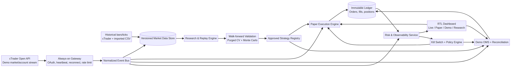

# نقشه راه تبدیل Hamed Trading Lab به سامانه زنده، Paper Trading و پژوهش تاریخی

**تاریخ ارزیابی:** ۲۰۲۶-۰۹-۰۹  
**نسخه مبنا:** `85b3f7c` به‌علاوه تغییرات محلی داشبورد ریسک و تست استرس  
**نویسنده:** Manus AI

## جمع‌بندی اجرایی

پروژه فعلی پایه مناسبی برای ساخت یک آزمایشگاه معاملاتی امن دارد، اما هنوز یک سامانه معاملاتی زنده واقعی نیست. فید بازار فعلی به‌صورت پیش‌فرض با random walk و `Math.random()` تولید می‌شود؛ wrapper مربوط به cTrader فقط ثابت‌ها و tracker سلامت را دارد؛ مسیر Demo تنها در صورت ثبت یک handler تأییدشده می‌تواند از حالت شبیه‌سازی خارج شود؛ و adapter دمو به endpointهایی اشاره می‌کند که اکنون در پروژه وجود ندارند.[1] [2] [3] [4]

بنابراین مسیر درست، افزودن مستقیم قابلیت «Live» به رابط کاربری نیست. مسیر درست سه مرحله دارد:

1. **واقعی‌کردن داده و زیرساخت اجرا:** اتصال دائمی و قابل بازیابی به cTrader Demo، ذخیره تاریخچه و eventها، و حذف ابهام میان `SIMULATED` و `LIVE`.
2. **ساخت Paper Trading وفادار و موتور پژوهش قابل اعتماد:** replay روی داده واقعی، مدل fill محافظه‌کارانه، walk-forward، کنترل overfitting و ثبت کامل experimentها.
3. **اثبات در Shadow و Demo و سپس Live محدود:** promotion فقط با گیت‌های عددی، کنترل تغییر، reconciliation واقعی و ریسک بسیار محدود.

> **اصل اصلی:** هوش مصنوعی می‌تواند تحلیل، رتبه‌بندی و توضیح تولید کند؛ اما محاسبه ریسک، وضعیت سفارش، کنترل مجری، stop policy و ارسال سفارش باید deterministic و قابل ممیزی بماند.



## وضعیت واقعی پروژه امروز

| حوزه | وضعیت فعلی | فاصله تا محصول واقعی |
|---|---|---|
| فید زنده | مولد تصادفی یک‌ثانیه‌ای، با امکان تزریق دستی quote | client واقعی cTrader، subscription، reconnect و sequence handling وجود ندارد |
| WebSocket cTrader | endpointها و tracker heartbeat تعریف شده‌اند | transport، auth، serialization، queue و dispatch پیام پیاده‌سازی نشده است |
| داده تاریخی | fixture داخلی و import CSV | downloader رسمی trendbar/tick، catalog داده، versioning و gap repair وجود ندارد |
| Paper execution | سفارش بلافاصله با slippage ثابت `FILLED` می‌شود | مدل touch، queue، spread، gap، partial fill، session و reject لازم است |
| Demo OMS | مرزهای ایمنی و outbox مناسب هستند | broker handler واقعی، execution events و reconciliation واقعی لازم است |
| API adapter | به `/api/ctrader/order` و `/api/ctrader/snapshot` اشاره می‌کند | این routeها اکنون وجود ندارند |
| ذخیره‌سازی | singleton حافظه‌ای و JSON فایل‌محور | تراکنش پایگاه داده، unique constraint و recovery چندفرایندی لازم است |
| پژوهش | replay، backtest، Monte Carlo و چند سبک وجود دارد | dataset version، walk-forward، purge/embargo و experiment registry لازم است |
| تست استرس | سناریوهای deterministic جدید اضافه شده‌اند | فعلاً high-fidelity نیستند و باید به event engine واقعی متصل شوند |

cTrader Open API به‌صورت رسمی market data زنده، داده تاریخی و عملیات معاملاتی را پشتیبانی می‌کند. اتصال از طریق TCP یا WebSocket ممکن است. پس از اتصال، app authentication الزامی است و heartbeat باید هر ۱۰ ثانیه ارسال شود. مستندات همچنین استفاده از queue برای ارسال و دریافت را توصیه می‌کند.[5] برای live bars ابتدا باید spot subscription برقرار شود و سپس live trendbar subscription ارسال شود. bid و ask اختیاری هستند و تبدیل قیمت نسبی با توجه به digits نماد لازم است.[6]

## معماری هدف

معماری باید از چهار plane مستقل تشکیل شود:

| Plane | مسئولیت | قانون جداسازی |
|---|---|---|
| Data Plane | دریافت quote، bar، tick، metadata و account event | هر datum دارای source، event time، receive time، sequence و quality باشد |
| Research Plane | replay، feature generation، backtest و validation | هیچ دسترسی به future event و هیچ دسترسی ارسال سفارش نداشته باشد |
| Execution Plane | Paper broker، Demo OMS، outbox و reconciliation | فقط strategy version تأییدشده و policy معتبر را اجرا کند |
| Control Plane | dashboard، auth، risk limits، kill switch و audit | هر تغییر حساس versioned و قابل بازگشت باشد |

رابط Next.js باید control plane باشد، نه محل نگهداری اتصال broker. اتصال WebSocket و worker اجرای سفارش باید یک فرایند همیشه‌روشن داشته باشند. state اصلی باید در پایگاه داده باشد؛ حافظه فقط cache محسوب شود.

## گزینه‌های اجرای ۲۴/۷

مطابق نیاز به WebSocket دائمی و پاسخ زیرثانیه‌ای، یک process پایدار لازم است. دو گزینه عملی وجود دارد:

| رویکرد | Tradeoffs | هزینه | پیچیدگی راه‌اندازی |
|---|---|---:|---:|
| سرویس مدیریت‌شده ۲۴/۷ با process واحد | بدون نگهداری سیستم‌عامل، مناسب WebSocket و worker سبک؛ محدود به 1 vCPU و 512 MB | مصرف‌محور؛ سقف تقریبی مصرف کامل ۲۴/۷ برابر ۳۷٫۵۰ دلار در ماه، پیش از کسر ۱۰ دلار اعتبار ماهانه؛ egress جدا | متوسط |
| اجرای دائمی روی لپ‌تاپ ویندوزی شخصی | هزینه میزبانی اضافه ندارد و دسترسی مستقیم برای توسعه آسان است؛ وابسته به روشن‌بودن دستگاه، اینترنت خانه و تنظیم auto-restart | بدون هزینه میزبانی اضافه | متوسط تا زیاد |

گزینه اول برای availability و نگهداری ساده‌تر است. گزینه دوم برای شروع ارزان و آزمایش شخصی مناسب است. انتخاب نهایی باید پیش از استقرار gateway انجام شود، زیرا topology اتصال، محل secret و recovery procedure به آن وابسته است.

## مرحله اول: داده واقعی و زیرساخت قابل اتکا

**مدت پیشنهادی:** ۳ تا ۵ هفته  
**هدف:** برنامه بتواند به‌صورت دائمی داده واقعی Demo را دریافت، ذخیره و بازپخش کند؛ هنوز هیچ سفارش واقعی یا Live فعال نمی‌شود.

### ۱.۱ ساخت cTrader Gateway واقعی

یک service مستقل با این state machine ساخته شود:

```text
DISCONNECTED
→ CONNECTING
→ APP_AUTHENTICATED
→ ACCOUNT_AUTHENTICATED
→ SUBSCRIBED
→ DEGRADED
→ RECONNECTING
```

وظایف اجرایی:

- اتصال TLS WebSocket به proxy دمو.
- app authentication و سپس account authentication.
- نگهداری access/refresh token فقط در secret store سرور.
- heartbeat هر ۱۰ ثانیه.
- reconnect با exponential backoff و jitter.
- outbound queue واحد برای جلوگیری از concurrent send.
- correlation میان `clientMsgId`، request، response و execution event.
- مدیریت `BLOCKED_PAYLOAD_TYPE` و `retryAfter`.
- subscription به spot، live trendbar و account execution events.
- کشف symbol ID و مشخصات نماد از broker؛ حذف symbol IDهای hard-coded.

cTrader سقف رسمی ۵۰ درخواست در ثانیه برای درخواست‌های غیرتاریخی و ۵ درخواست در ثانیه برای درخواست‌های تاریخی در هر connection اعلام کرده است؛ limiter داخلی gateway باید پایین‌تر از این سقف تنظیم شود.[7]

### ۱.۲ ساخت Market Data Store

حداقل schema پیشنهادی:

```text
symbols
quotes
bars
raw_market_events
feed_sessions
data_quality_incidents
datasets
```

هر quote باید فیلدهای زیر را داشته باشد:

```text
source_event_time
received_at
symbol_id
bid
ask
sequence_or_message_id
source = CTRADER_DEMO
quality = LIVE | STALE | GAP | REPAIRED
feed_session_id
```

وظایف اجرایی:

- unique index برای eventهای تکراری.
- partition یا index زمانی برای quote و bar.
- ذخیره raw event برای forensic replay.
- ساخت bar فقط از tick/spot معتبر یا دریافت trendbar رسمی.
- تشخیص gap، timestamp معکوس، spread منفی، bid بزرگ‌تر از ask و outlier.
- repair job برای دریافت trendbar تاریخی از cTrader.
- version و hash برای هر dataset پژوهشی.

cTrader برای trendbarهای تاریخی request رسمی و برای tick history محدودیت بازه حداکثر یک هفته در هر درخواست دارد. پاسخ tick نیز ممکن است با `hasMore` صفحه‌بندی شود.[6]

### ۱.۳ واقعی‌کردن APIهای بازار

مسیرهای جدید یا اصلاح‌شده:

```text
GET /api/market/status
GET /api/market/quotes?symbols=XAUUSD,EURUSD
GET /api/market/bars?symbol=XAUUSD&period=M5&from=...&to=...
GET /api/datasets
POST /api/datasets/import
POST /api/datasets/repair
```

UI باید چهار badge غیرقابل‌اشتباه نشان دهد:

- `LIVE — cTrader Demo`
- `DELAYED`
- `STALE/UNKNOWN`
- `SIMULATED`

در هیچ شرایطی quote شبیه‌سازی‌شده نباید badge زنده بگیرد.

### گیت خروج مرحله اول

| معیار | حد عبور |
|---|---:|
| uptime اتصال Demo در تست soak | حداقل ۷۲ ساعت |
| heartbeat ناموفق بدون تشخیص | صفر |
| quote با bid/ask نامعتبر | صفر پس از validation |
| duplicate event | صفر پس از unique constraint |
| gap بدون ثبت incident | صفر |
| reconnect موفق | ۱۰۰٪ سناریوهای تست‌شده |
| secret در client/log | صفر |
| تشخیص source در UI | ۱۰۰٪ quoteها |

## مرحله دوم: Paper Trading وفادار و موتور تربیت روی گذشته

**مدت پیشنهادی:** ۵ تا ۸ هفته  
**هدف:** استفاده از قیمت واقعی برای Paper Live و استفاده از تاریخچه versioned برای پژوهش قابل تکرار.

### ۲.۱ ساخت Paper Broker event-driven

Paper Broker فعلی سفارش Limit را بلافاصله `FILLED` می‌کند؛ این رفتار برای ارزیابی execution بیش از حد خوش‌بینانه است.[3] مدل جدید باید state machine کامل داشته باشد:

```text
CREATED → ACCEPTED → WORKING → PARTIALLY_FILLED → FILLED
                         ↘ REJECTED / EXPIRED / CANCELLED
```

قواعد fill پیشنهادی:

- Buy limit فقط با عبور ask از قیمت limit قابل fill است.
- Sell limit فقط با عبور bid از قیمت limit قابل fill است.
- gap باید در اولین قیمت قابل معامله بعدی fill شود، نه قیمت مطلوب گذشته.
- slippage تابع spread، volatility، latency و liquidity proxy باشد.
- partial fill و queue position به‌صورت configurable مدل شوند.
- commission، swap، market session و min/step volume از symbol metadata واقعی گرفته شوند.
- stop loss و take profit با bid/ask مناسب سمت معامله trigger شوند.
- feed در وضعیت STALE یا UNKNOWN باعث توقف entry شود.

### ۲.۲ ساخت Dataset Registry و Replay قابل بازتولید

هر اجرای research باید این metadata را ذخیره کند:

```text
dataset_id
dataset_hash
source
symbol
period
from/to
strategy_version
parameter_set
seed
commission_model
spread_model
fill_model
code_commit
```

ReplayEngine نباید فقط fixture داخلی را انتخاب کند. constructor باید یک `MarketDataSource` دریافت کند. این interface می‌تواند adapterهای زیر داشته باشد:

- `FixtureDataSource`
- `CsvDataSource`
- `DatabaseDataSource`
- `CTraderHistoricalDataSource`

### ۲.۳ تعریف معنای صحیح «تربیت»

در این محصول، تربیت باید ابتدا به معنای **کالیبراسیون و انتخاب استراتژی** باشد، نه آموزش آنلاین یک مدل روی سود و زیان اخیر. pipeline پیشنهادی:

1. ingest و validation داده.
2. feature snapshot فقط از اطلاعات موجود تا زمان تصمیم.
3. تقسیم زمانی train/validation/test.
4. purge و embargo اطراف مرزها برای جلوگیری از leakage.
5. parameter search فقط روی train.
6. انتخاب مدل روی validation.
7. یک‌بار ارزیابی روی test قفل‌شده.
8. walk-forward چند پنجره‌ای.
9. Monte Carlo روی ترتیب معاملات، spread و slippage.
10. ثبت candidate در Strategy Registry.

مدل یا rule فقط زمانی به Paper Live منتقل شود که نسخه، dataset و پارامترهای آن immutable شده باشند. تغییر پارامتر در Paper Live باید نسخه جدید بسازد؛ نباید نتیجه قبلی را بازنویسی کند.

### ۲.۴ معیارهای ضد overfitting

این آستانه‌ها پیشنهاد مهندسی هستند و باید با سبک معاملاتی تنظیم شوند:

| معیار | گیت پیشنهادی |
|---|---:|
| look-ahead violation | صفر |
| اجرای دوباره با seed یکسان | نتیجه یکسان |
| تعداد walk-forward fold | حداقل ۶ |
| عملکرد مثبت خارج نمونه | حداقل در ۴ از ۶ fold |
| Profit Factor خارج نمونه | بالاتر از ۱٫۱۵ پس از هزینه |
| Max drawdown | پایین‌تر از سقف policy |
| حساسیت پارامتر | بدون collapse در تغییر ±۱۰٪ |
| سود وابسته به چند معامله | حداکثر ۲۰٪ سود از بهترین ۵ معامله |
| stress invariants | صفر نقض |

### ۲.۵ اتصال تست استرس به موتور واقعی

سناریوهای فعلی باید از محاسبه خلاصه مستقل خارج و به event engine تزریق شوند. هر سناریو باید quote/bar/event واقعی تولید کند و همان Paper Broker و ledger تولیدی را اجرا کند. سپس invariantها روی ledger بررسی شوند:

- equity reconciliation.
- idempotency.
- no-entry-on-stale.
- protection placement.
- drawdown halt.
- no retry before reconciliation.

### گیت خروج مرحله دوم

| معیار | حد عبور |
|---|---:|
| replay deterministic | ۱۰۰٪ |
| mismatch دفترکل | صفر |
| Paper fill بدون touch | صفر |
| ورود روی stale feed | صفر |
| duplicate order | صفر |
| dataset بدون hash/version | صفر |
| تست‌های دامنه | ۱۰۰٪ موفق |
| historical leakage | صفر در audit |

## مرحله سوم: Shadow، Demo واقعی و Live محدود

**مدت پیشنهادی:** حداقل ۸ تا ۱۶ هفته اثبات؛ وابسته به تعداد معاملات  
**هدف:** اثبات برابری رفتار پژوهش، Paper و Demo پیش از هرگونه ریسک پول واقعی.

### ۳.۱ Shadow Live

استراتژی روی داده زنده تصمیم تولید می‌کند، اما هیچ سفارش broker ارسال نمی‌شود. برای هر تصمیم ثبت شود:

```text
signal_time
decision_price
expected_entry
paper_fill
broker_quote_at_decision
risk_decision
model_version
rejection_reason
```

این مرحله اختلاف میان backtest و شرایط واقعی مانند latency، spread و missing quotes را آشکار می‌کند.

### ۳.۲ اتصال واقعی Demo

کارهای اصلی:

- پیاده‌سازی broker command handler واقعی با `ProtoOANewOrderReq`.
- دریافت `ProtoOAExecutionEvent` برای accepted، filled، rejected و server events.[8]
- پیاده‌سازی amend SL/TP، cancel و close.
- snapshot واقعی حساب، order، deal و position.
- reconciliation در startup، reconnect و timeout.
- mapping پایدار میان intent، order، deal و position.
- ثبت confirmation واقعی protection؛ نه مقدار ساخته‌شده.
- حذف endpointهای خیالی یا پیاده‌سازی واقعی `/api/ctrader/order` و `/api/ctrader/snapshot`.

### ۳.۳ گیت Promotion از Paper به Demo

شرط عبور باید «هرکدام دیرتر رخ دهد» باشد:

- حداقل ۱۲ هفته Paper Live.
- حداقل ۲۰۰ معامله مستقل برای سبک پرتعداد؛ برای سبک کم‌تعداد، دوره طولانی‌تر و تحلیل آماری متناسب.
- صفر breach در سقف ریسک.
- صفر duplicate.
- صفر reconciliation حل‌نشده.
- تفاوت fill مدل و quote واقعی در محدوده از پیش تعریف‌شده.
- عملکرد خارج نمونه پس از هزینه مثبت.
- تمام incidentهای شدید دارای root-cause و test regression باشند.

### ۳.۴ گیت Promotion از Demo به Live

Live در وضعیت فعلی پروژه عمداً مسدود است و این سیاست باید حفظ شود.[9] بازکردن آن فقط پس از یک release جداگانه انجام شود. پیشنهاد canary اولیه:

| کنترل | مقدار پیشنهادی اولیه |
|---|---:|
| ریسک هر معامله | حداکثر ۰٫۰۵٪ equity |
| زیان روزانه | توقف در ۰٫۵٪ |
| زیان هفتگی | توقف در ۱٪ |
| پوزیشن هم‌زمان | ۱ |
| نماد | ابتدا فقط یک نماد |
| نوع سفارش | فقط Limit با SL اجباری |
| تأیید | دستی و کوتاه‌عمر |
| فعال‌سازی مجدد بعد از halt | فقط با review انسانی |

این اعداد تضمین سود نیستند؛ فقط دامنه خسارت فنی در مرحله canary را محدود می‌کنند.

## Backlog اجرایی پیشنهادی

| Sprint | تسک‌ها | خروجی قابل سنجش |
|---:|---|---|
| ۱ | DB schema، migration، market event contract، gateway skeleton | ذخیره session و event خام |
| ۲ | app/account auth، heartbeat، reconnect، limiter | soak test اتصال Demo |
| ۳ | symbol discovery، spot/trendbar subscription، data quality | quote و bar واقعی در dashboard |
| ۴ | historical downloader، pagination، repair و dataset hash | dataset versioned XAUUSD/EURUSD |
| ۵ | Paper Broker state machine و ledger تراکنشی | fill فقط بر اساس bid/ask واقعی |
| ۶ | spread/slippage/partial-fill model و تست property | تطبیق invariantها |
| ۷ | DataSource abstraction و replay روی DB | replay یک dataset واقعی |
| ۸ | walk-forward، purge/embargo و experiment registry | گزارش خارج نمونه قابل تکرار |
| ۹ | stress injection به event engine | سناریوهای بحرانی high-fidelity |
| ۱۰ | Demo order handler و execution-event consumer | سفارش Demo واقعی با SL/TP |
| ۱۱ | reconciliation startup/reconnect و chaos tests | recovery بدون duplicate |
| ۱۲+ | Shadow soak، Paper evidence و promotion review | تصمیم Go/No-Go مستند |

## تغییرات پیشنهادی در ساختار کد

```text
services/
  ctrader-gateway/
    connection-manager.ts
    auth-session.ts
    message-codec.ts
    market-subscriptions.ts
    execution-events.ts
    request-queue.ts
    reconnect-policy.ts

lib/
  market-data/
    contracts.ts
    repository.ts
    quality-monitor.ts
    bar-builder.ts
    dataset-registry.ts
  execution/
    paper-broker.ts
    fill-model.ts
    ledger.ts
    risk-policy.ts
    reconciliation.ts
  research/
    data-source.ts
    experiment-registry.ts
    walk-forward.ts
    leakage-guards.ts
    promotion-scorecard.ts
```

## تصمیم‌های فنی غیرقابل‌مذاکره

1. **Browser هیچ secret یا اتصال مستقیم broker نداشته باشد.**
2. **Simulated و Live در type system و UI دو منبع متفاوت باشند.**
3. **هیچ سفارش بدون ثبت transactional outbox ارسال نشود.**
4. **هر timeout ابتدا UNKNOWN و سپس reconciliation باشد؛ retry کور ممنوع است.**
5. **هر dataset، strategy و run شناسه نسخه و hash داشته باشد.**
6. **AI اجازه تغییر risk limit یا ارسال مستقیم سفارش نداشته باشد.**
7. **Live activation یک تغییر config ساده نباشد؛ release و approval مستقل بخواهد.**
8. **backtest، Paper و Demo از یک هسته strategy و risk استفاده کنند.**

## تعریف موفقیت نهایی

محصول زمانی «واقعاً زنده و قابل اتکا» است که بتوان یک تصمیم معاملاتی را از dataset یا quote اولیه تا feature، signal، risk decision، order intent، broker event، fill، position و journal با یک correlation ID ردیابی کرد؛ سپس همان رویدادها را در replay بازتولید کرد و به نتیجه یکسان رسید.

در وضعیت فعلی، توصیه من آغاز از **مرحله اول: gateway واقعی Demo و Market Data Store** است. افزودن مدل‌های بیشتر یا AI پیچیده‌تر پیش از واقعی‌شدن داده و execution، تنها ظاهر محصول را هوشمندتر می‌کند و کیفیت تصمیم را الزاماً افزایش نمی‌دهد.

## افشای مبنا و محدودیت‌ها

**مبنا:** ارزیابی بر اساس کد مخزن در commit `85b3f7c` و تغییرات محلی فعلی انجام شده است. تعریف «واقعی» در این گزارش یعنی داده و event از cTrader Demo با trace و persistence قابل ممیزی، نه random walk یا شناسه ساختگی.  
**زمان:** مستندات و وضعیت پروژه در تاریخ ۲۰۲۶-۰۹-۰۹ بررسی شده‌اند.  
**فرض‌ها:** نمادهای اولیه XAUUSD و EURUSD، محیط توسعه و اثبات Demo، سفارش Limit و کنترل دستی حفظ شده‌اند.  
**منابع و اطمینان:** یافته‌های داخلی مستقیماً از کد پروژه و قابلیت‌های API از مستندات رسمی cTrader استخراج شده‌اند. آستانه‌های promotion پیشنهاد مهندسی هستند و باید با سبک و تعداد معاملات کالیبره شوند.  
**رعایت مقررات:** این گزارش صرفاً پژوهش و تحلیل فنی است و توصیه مالی شخصی محسوب نمی‌شود.

## References

[1]: https://github.com/hamedharami-hub/Tradewithhamed/blob/85b3f7c/lib/server/live-market-feed.ts "Current LiveMarketFeed implementation"

[2]: https://github.com/hamedharami-hub/Tradewithhamed/blob/85b3f7c/lib/server/ctrader-websocket.ts "Current cTrader WebSocket tracker implementation"

[3]: https://github.com/hamedharami-hub/Tradewithhamed/blob/85b3f7c/lib/core/broker-adapter.ts "Current paper and cTrader broker adapters"

[4]: https://github.com/hamedharami-hub/Tradewithhamed/tree/85b3f7c/app/api "Current API route inventory"

[5]: https://help.ctrader.com/open-api/connection/ "cTrader Open API — Establish a connection"

[6]: https://help.ctrader.com/open-api/symbol-data/ "cTrader Open API — Attain symbol data"

[7]: https://help.ctrader.com/open-api/ "cTrader Open API — Getting started and rate limits"

[8]: https://help.ctrader.com/open-api/messages/ "cTrader Open API — Messages and execution events"

[9]: https://github.com/hamedharami-hub/Tradewithhamed/blob/85b3f7c/lib/server/ctrader-auth.ts "Current demo-only security boundary"
